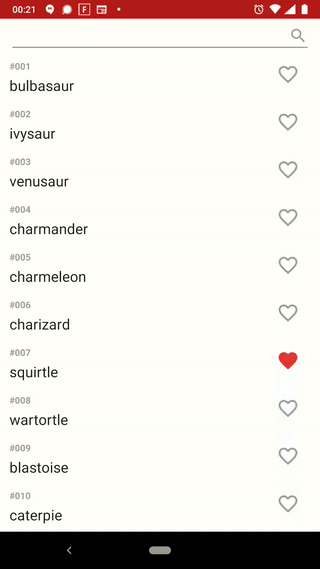

# Pokemon
This application presents some of the PokeAPI features. Basic functional requirements that are met:
- recycler view used to present Pokemons (dynamic loading),
- persisting favourite Pokemons using db,
- searching Pokemons,
- detailed Pokemon view.

Architecture: MVP
Tech stack & libs: Java 8, Retrofit2, RxJava3, Room2, Glide & AndroidSVG, Jetpack's data binding, Chip & ChipGroup from Material Components

As Potential improvements - lots could be fixed, some places contain info about what simplification was used. Main disadventage is that for now app fetches only 50 first results. This app could use some DI, for example for injecting NetworkModule. Models are a bit messy, and Glide is breaking MVP pattern in PokemonDetailsActivity.

